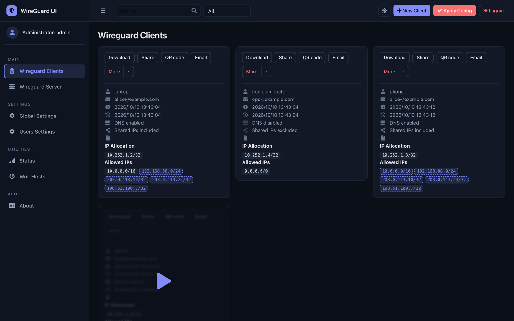
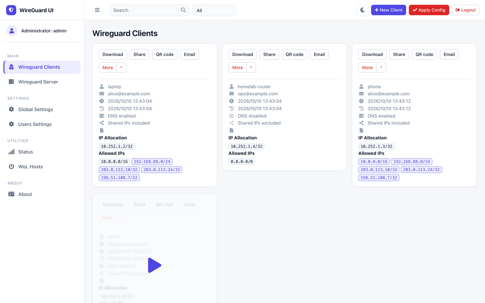
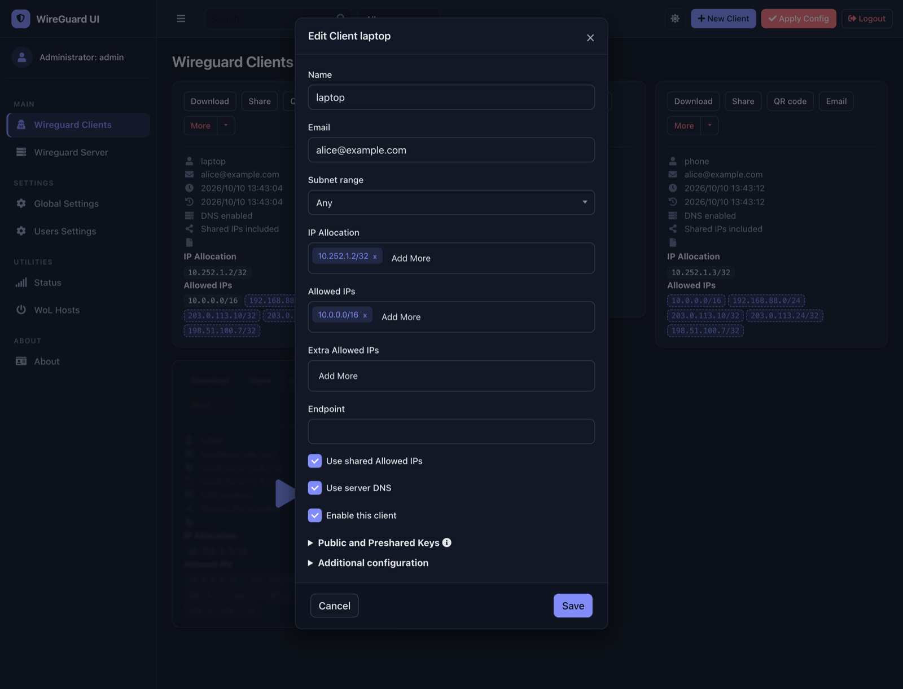
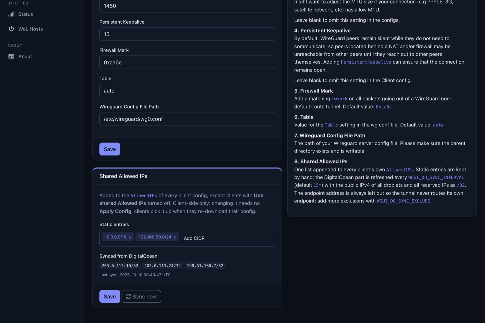
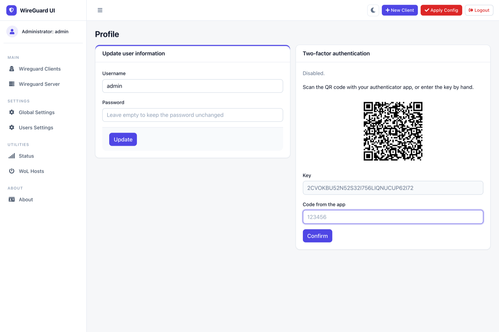
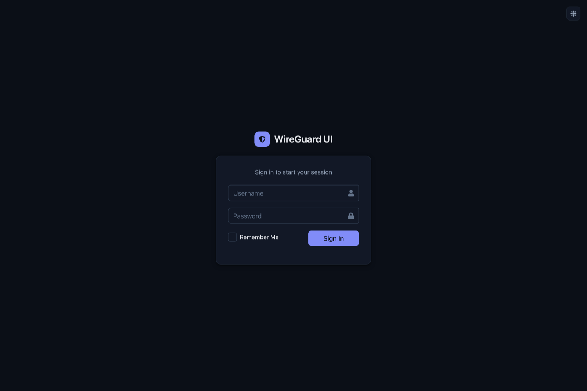
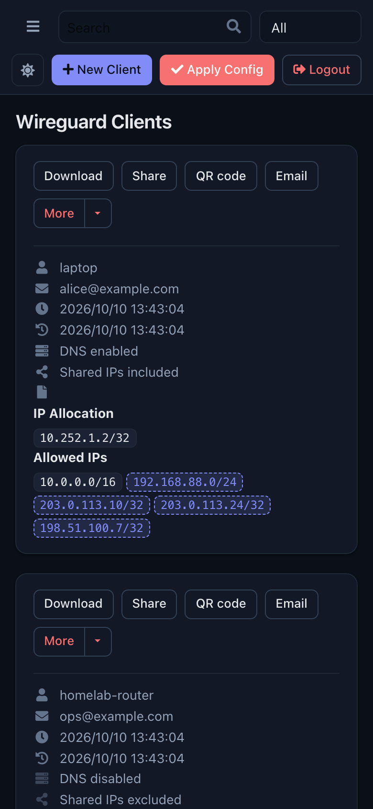

# wireguard-ui

[](https://github.com/obervinov/wireguard-ui/actions/workflows/pr.yaml)
[](https://github.com/obervinov/wireguard-ui/actions/workflows/release.yaml)


A web user interface to manage your WireGuard setup.

This is a maintained fork of [ngoduykhanh/wireguard-ui](https://github.com/ngoduykhanh/wireguard-ui), branched from
upstream `v0.6.2`, which is no longer maintained. Images are published to `ghcr.io/obervinov/wireguard-ui`. What changed
in each release is in [CHANGELOG.md](CHANGELOG.md).



## Features

- Friendly UI with light and dark themes; works offline, all assets are served by wgui itself
- Authentication, with optional TOTP two-factor and recovery codes (Profile page)
- Manage extra client information (name, email, etc.)
- Retrieve client config using QR code / file / email / Telegram, or a one-time Enclosed link
- One shared Allowed IPs list for all clients, optionally synced from a cloud provider (currently DigitalOcean only)

### Added in this fork

- **Shared Allowed IPs.** One list appended to every client config, edited in Global Settings. It can also be filled
  automatically from a cloud provider account. Currently only DigitalOcean is supported: with `WGUI_DO_TOKEN` set,
  the list is refreshed with the public IPv4 of all droplets and all reserved IPs. The endpoint address is always left out.
  A client can opt out with **Use shared Allowed IPs**, and its card shows the shared entries as dashed badges.
- **Two-factor authentication.** TOTP from any authenticator app, 8 one-time recovery codes, a lockout after 5 wrong
  codes, and an admin reset on the Users page.
- **One-time share links.** With `WGUI_ENCLOSED_URL` set, **Share** on a client card encrypts the config in wgui and
  stores it on an [Enclosed](https://github.com/CorentinTh/enclosed) instance as a note that is deleted after the first
  read. The key stays in the link fragment, so the instance only sees ciphertext. The note includes a `.conf` file
  that imports straight into the WireGuard app.
- **New theme.** Light and dark mode that follows the system or the toggle in the navbar, and a layout that works on
  a phone.
- **Fixes.** `POST /login` no longer panics on missing fields; the user API no longer returns password hashes.

## Screenshots

| | |
|---|---|
|  |  |
|  |  |
|  |  |

## Run WireGuard-UI

> ⚠️The default username and password are `admin`. Please change it to secure your setup.

### Using docker

```
docker run -d --name wireguard-ui --cap-add NET_ADMIN --network host \
  -v /etc/wireguard:/etc/wireguard -v ./db:/app/db \
  ghcr.io/obervinov/wireguard-ui:latest
```

Pin a release tag (for example `v0.8.0`) instead of `latest` in production. Prebuilt binaries are not published; see
[Build binary file](#build-binary-file).

### Using docker compose

The [examples/docker-compose](examples/docker-compose) folder contains example docker-compose files.
Choose the example which fits you the most, adjust the configuration for your needs, then run it like below:

```
docker-compose up
```

## Environment Variables

| Variable                      | Description                                                                                                                                                                                                                                                                         | Default                            |
|-------------------------------|-------------------------------------------------------------------------------------------------------------------------------------------------------------------------------------------------------------------------------------------------------------------------------------|------------------------------------|
| `BASE_PATH`                   | Set this variable if you run wireguard-ui under a subpath of your reverse proxy virtual host (e.g. /wireguard)                                                                                                                                                                      | N/A                                |
| `BIND_ADDRESS`                | The addresses that can access to the web interface and the port, use unix:///abspath/to/file.socket for unix domain socket.                                                                                                                                                         | 0.0.0.0:80                         |
| `SESSION_SECRET`              | The secret key used to encrypt the session cookies. Set this to a random value                                                                                                                                                                                                      | N/A                                |
| `SESSION_SECRET_FILE`         | Optional filepath for the secret key used to encrypt the session cookies. Leave `SESSION_SECRET` blank to take effect                                                                                                                                                               | N/A                                |
| `SESSION_MAX_DURATION`        | Max time in days a remembered session is refreshed and valid. Non-refreshed session is valid for 7 days max, regardless of this setting.                                                                                                                                            | 90                                 |
| `SUBNET_RANGES`               | The list of address subdivision ranges. Format: `SR Name:10.0.1.0/24; SR2:10.0.2.0/24,10.0.3.0/24` Each CIDR must be inside one of the server interfaces.                                                                                                                           | N/A                                |
| `WGUI_DO_TOKEN`               | Read-only DigitalOcean API token. When set, the shared Allowed IPs list is synced with the public IPv4 of all droplets and all reserved IPs (as `/32`). The endpoint address is always excluded | N/A |
| `WGUI_DO_TOKEN_FILE`          | The same as `WGUI_DO_TOKEN`, read from a file | N/A |
| `WGUI_DO_SYNC_INTERVAL`       | How often the DigitalOcean sync runs, as a Go duration | `15m` |
| `WGUI_DO_SYNC_EXCLUDE`        | Comma-separated IPs to leave out of the DigitalOcean sync | N/A |
| `WGUI_ENCLOSED_URL`           | Base URL of an [Enclosed](https://github.com/CorentinTh/enclosed) instance, e.g. `https://enclosed.example.com`. When set, client cards get a **Share** button that encrypts the config locally and returns a one-time link (deleted after the first read). The instance must not require authentication | N/A |
| `WGUI_ENCLOSED_TTL`           | How long a shared link stays valid, as a Go duration, clamped to Enclosed's `10m`..`720h` | `1h` |
| `WGUI_USERNAME`               | The username for the login page. Used for db initialization only                                                                                                                                                                                                                    | `admin`                            |
| `WGUI_PASSWORD`               | The password for the user on the login page. Will be hashed automatically. Used for db initialization only                                                                                                                                                                          | `admin`                            |
| `WGUI_PASSWORD_FILE`          | Optional filepath for the user login password. Will be hashed automatically. Used for db initialization only. Leave `WGUI_PASSWORD` blank to take effect                                                                                                                            | N/A                                |
| `WGUI_PASSWORD_HASH`          | The password hash for the user on the login page. (alternative to `WGUI_PASSWORD`). Used for db initialization only                                                                                                                                                                 | N/A                                |
| `WGUI_PASSWORD_HASH_FILE`     | Optional filepath for the user login password hash. (alternative to `WGUI_PASSWORD_FILE`). Used for db initialization only. Leave `WGUI_PASSWORD_HASH` blank to take effect                                                                                                         | N/A                                |
| `WGUI_ENDPOINT_ADDRESS`       | The default endpoint address used in global settings where clients should connect to. The endpoint can contain a port as well, useful when you are listening internally on the `WGUI_SERVER_LISTEN_PORT` port, but you forward on another port (ex 9000). Ex: myvpn.dyndns.com:9000 | Resolved to your public ip address |
| `WGUI_FAVICON_FILE_PATH`      | The file path used as website favicon                                                                                                                                                                                                                                               | Embedded WireGuard logo            |
| `WGUI_DNS`                    | The default DNS servers (comma-separated-list) used in the global settings                                                                                                                                                                                                          | `1.1.1.1`                          |
| `WGUI_MTU`                    | The default MTU used in global settings                                                                                                                                                                                                                                             | `1450`                             |
| `WGUI_PERSISTENT_KEEPALIVE`   | The default persistent keepalive for WireGuard in global settings                                                                                                                                                                                                                   | `15`                               |
| `WGUI_FIREWALL_MARK`          | The default WireGuard firewall mark                                                                                                                                                                                                                                                 | `0xca6c`  (51820)                  |
| `WGUI_TABLE`                  | The default WireGuard table value settings                                                                                                                                                                                                                                          | `auto`                             |
| `WGUI_CONFIG_FILE_PATH`       | The default WireGuard config file path used in global settings                                                                                                                                                                                                                      | `/etc/wireguard/wg0.conf`          |
| `WGUI_LOG_LEVEL`              | The default log level. Possible values: `DEBUG`, `INFO`, `WARN`, `ERROR`, `OFF`                                                                                                                                                                                                     | `INFO`                             |
| `WG_CONF_TEMPLATE`            | The custom `wg.conf` config file template. Please refer to our [default template](templates/wg.conf)                                                                                                                        | N/A                                |
| `EMAIL_FROM_ADDRESS`          | The sender email address                                                                                                                                                                                                                                                            | N/A                                |
| `EMAIL_FROM_NAME`             | The sender name                                                                                                                                                                                                                                                                     | `WireGuard UI`                     |
| `SENDGRID_API_KEY`            | The SendGrid api key                                                                                                                                                                                                                                                                | N/A                                |
| `SENDGRID_API_KEY_FILE`       | Optional filepath for the SendGrid api key. Leave `SENDGRID_API_KEY` blank to take effect                                                                                                                                                                                           | N/A                                |
| `SMTP_HOSTNAME`               | The SMTP IP address or hostname                                                                                                                                                                                                                                                     | `127.0.0.1`                        |
| `SMTP_PORT`                   | The SMTP port                                                                                                                                                                                                                                                                       | `25`                               |
| `SMTP_USERNAME`               | The SMTP username                                                                                                                                                                                                                                                                   | N/A                                |
| `SMTP_PASSWORD`               | The SMTP user password                                                                                                                                                                                                                                                              | N/A                                |
| `SMTP_PASSWORD_FILE`          | Optional filepath for the SMTP user password. Leave `SMTP_PASSWORD` blank to take effect                                                                                                                                                                                            | N/A                                |
| `SMTP_AUTH_TYPE`              | The SMTP authentication type. Possible values: `PLAIN`, `LOGIN`, `NONE`                                                                                                                                                                                                             | `NONE`                             |
| `SMTP_ENCRYPTION`             | The encryption method. Possible values: `NONE`, `SSL`, `SSLTLS`, `TLS`, `STARTTLS`                                                                                                                                                                                                  | `STARTTLS`                         |
| `SMTP_HELO`                   | Hostname to use for the HELO message. smtp-relay.gmail.com needs this set to anything but `localhost`                                                                                                                                                                               | `localhost`                        |
| `TELEGRAM_TOKEN`              | Telegram bot token for distributing configs to clients                                                                                                                                                                                                                              | N/A                                |
| `TELEGRAM_ALLOW_CONF_REQUEST` | Allow users to get configs from the bot by sending a message                                                                                                                                                                                                                        | `false`                            |
| `TELEGRAM_FLOOD_WAIT`         | Time in minutes before the next conf request is processed                                                                                                                                                                                                                           | `60`                               |

### Defaults for server configuration

These environment variables are used to control the default server settings used when initializing the database.

| Variable                          | Description                                                                                   | Default         |
|-----------------------------------|-----------------------------------------------------------------------------------------------|-----------------|
| `WGUI_SERVER_INTERFACE_ADDRESSES` | The default interface addresses (comma-separated-list) for the WireGuard server configuration | `10.252.1.0/24` |
| `WGUI_SERVER_LISTEN_PORT`         | The default server listen port                                                                | `51820`         |
| `WGUI_SERVER_POST_UP_SCRIPT`      | The default server post-up script                                                             | N/A             |
| `WGUI_SERVER_POST_DOWN_SCRIPT`    | The default server post-down script                                                           | N/A             |

### Defaults for new clients

These environment variables are used to set the defaults used in `New Client` dialog.

| Variable                                    | Description                                                                                     | Default     |
|---------------------------------------------|-------------------------------------------------------------------------------------------------|-------------|
| `WGUI_DEFAULT_CLIENT_ALLOWED_IPS`           | Comma-separated-list of CIDRs for the `Allowed IPs` field. (default )                           | `0.0.0.0/0` |
| `WGUI_DEFAULT_CLIENT_EXTRA_ALLOWED_IPS`     | Comma-separated-list of CIDRs for the `Extra Allowed IPs` field. (default empty)                | N/A         |
| `WGUI_DEFAULT_CLIENT_USE_SERVER_DNS`        | Boolean value [`0`, `f`, `F`, `false`, `False`, `FALSE`, `1`, `t`, `T`, `true`, `True`, `TRUE`] | `true`      |
| `WGUI_DEFAULT_CLIENT_ENABLE_AFTER_CREATION` | Boolean value [`0`, `f`, `F`, `false`, `False`, `FALSE`, `1`, `t`, `T`, `true`, `True`, `TRUE`] | `true`      |

### Docker only

These environment variables only apply to the docker container.

| Variable              | Description                                                   | Default |
|-----------------------|---------------------------------------------------------------|---------|
| `WGUI_MANAGE_START`   | Start/stop WireGuard when the container is started/stopped    | `false` |
| `WGUI_MANAGE_RESTART` | Auto restart WireGuard when we Apply Config changes in the UI | `false` |

## Auto restart WireGuard daemon

WireGuard-UI only takes care of configuration generation. You can use systemd to watch for the changes and restart the
service. Following is an example:

### Using systemd

Create `/etc/systemd/system/wgui.service`

```bash
cd /etc/systemd/system/
cat << EOF > wgui.service
[Unit]
Description=Restart WireGuard
After=network.target

[Service]
Type=oneshot
ExecStart=/usr/bin/systemctl restart wg-quick@wg0.service

[Install]
RequiredBy=wgui.path
EOF
```

Create `/etc/systemd/system/wgui.path`

```bash
cd /etc/systemd/system/
cat << EOF > wgui.path
[Unit]
Description=Watch /etc/wireguard/wg0.conf for changes

[Path]
PathModified=/etc/wireguard/wg0.conf

[Install]
WantedBy=multi-user.target
EOF
```

Apply it

```sh
systemctl enable wgui.{path,service}
systemctl start wgui.{path,service}
```

### Using openrc

Create `/usr/local/bin/wgui` file and make it executable

```sh
cd /usr/local/bin/
cat << EOF > wgui
#!/bin/sh
wg-quick down wg0
wg-quick up wg0
EOF
chmod +x wgui
```

Create `/etc/init.d/wgui` file and make it executable

```sh
cd /etc/init.d/
cat << EOF > wgui
#!/sbin/openrc-run

command=/sbin/inotifyd
command_args="/usr/local/bin/wgui /etc/wireguard/wg0.conf:w"
pidfile=/run/${RC_SVCNAME}.pid
command_background=yes
EOF
chmod +x wgui
```

Apply it

```sh
rc-service wgui start
rc-update add wgui default
```

### Using Docker

Set `WGUI_MANAGE_RESTART=true` to manage Wireguard interface restarts.
Using `WGUI_MANAGE_START=true` can also replace the function of `wg-quick@wg0` service, to start Wireguard at boot, by
running the container with `restart: unless-stopped`. These settings can also pick up changes to Wireguard Config File
Path, after restarting the container. Please make sure you have `--cap-add=NET_ADMIN` in your container config to make
this feature work.

## Build

### Build docker image

Go to the project root directory and run the following command:

```sh
docker build --build-arg=GIT_COMMIT=$(git rev-parse --short HEAD) -t wireguard-ui .
```

or

```sh
docker compose build --build-arg=GIT_COMMIT=$(git rev-parse --short HEAD)
```

:information_source: Prebuilt images are published to
[GHCR](https://github.com/obervinov/wireguard-ui/pkgs/container/wireguard-ui):

```
docker pull ghcr.io/obervinov/wireguard-ui:latest
```

### Build binary file

Prepare the assets directory

```sh
./prepare_assets.sh
```

Then build your executable

```sh
go build -o wireguard-ui
```

## License

MIT. See [LICENSE](LICENSE).

## Thanks

Thanks to [Khanh Ngo](https://github.com/ngoduykhanh) and all contributors of
[ngoduykhanh/wireguard-ui](https://github.com/ngoduykhanh/wireguard-ui) for the project this fork is built on.
If it helped you, you can support the original author:

<a href="https://www.buymeacoffee.com/khanhngo" target="_blank"></a>
